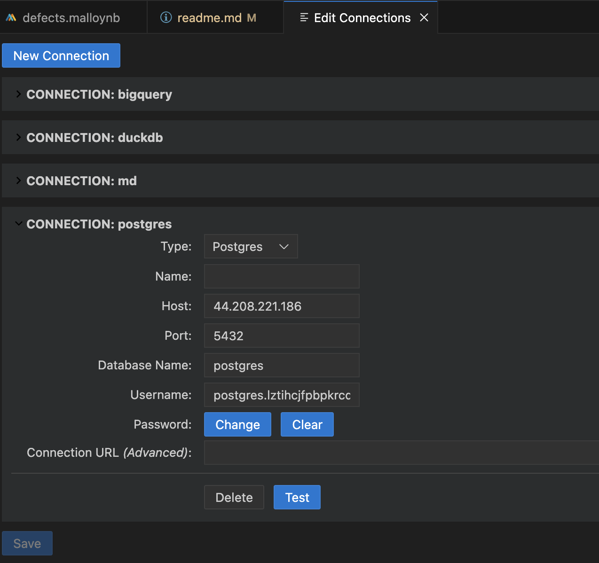

## How to Set Up and Run `defects.malloy` or `defects.malloynb`

1. Clone the repository and open it in VS Code desktop or GitHub Codespaces. Enable the `Malloy` VS Code plugin.
2. Define the data source from `defects.csv`. If using PostgreSQL, set up the connection using the VS Code Command Palette.
3. Define measures: `defects_count` and `pcnt_of_defects`.
4. Define views: `by_priority`, `by_status`, `by_assignee`, and `by_epic`.
5. Run the provided queries to analyze defects.

## PostgreSQL connection Setup

* Key-in `shift + cmd + P` to open connection setup form
* Enter connection details
* Test & Save

